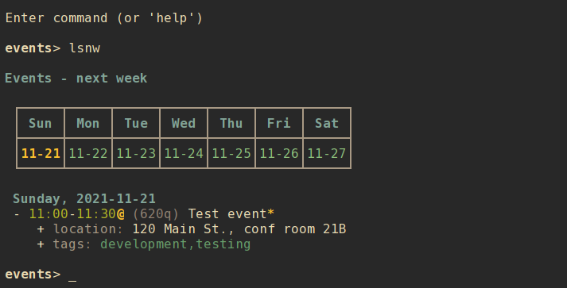
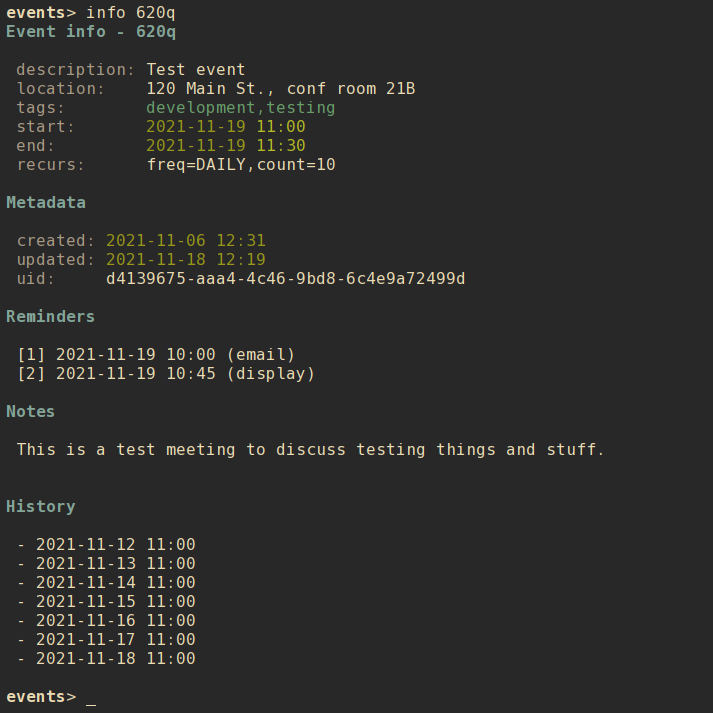

# nrrddate

A terminal-based calendar management program with advanced search options, formatted output, and event data stored in local text files.

    > nrrddate query start=2021-11-01~2021-11-15%tags=projectx --limit start,end,description
    2021-11-01 09:30    2021-11-01 10:30    Weekly status call for Project X
    2021-11-03 13:00    2021-11-03 14:00    Project X sprint planning
    2021-11-08 09:00    2021-11-08 12:00    Code review
    2021-11-10 14:00    2021-11-10 16:00    Project X sprint review

## Contents

- [Getting nrrddate](#getting-nrrddate)
    - [Downloading](#downloading)
    - [Python dependencies](#python-dependencies)
    - [Installing](#installing)
        - [Setuptools](#setuptools)
        - [Make](#make)
- [Using nrrddate](#using-nrrddate)
    - [Basic usage](#basic-usage)
    - [Command-line usage](#command-line-usage)
        - [Listing events](#listing-events)
        - [Viewing an event](#viewing-an-event)
        - [Creating a new event](#creating-a-new-event)
        - [Modifying an event](#modifying-an-event)
        - [Clearing values from an event](#clearing-values-from-an-event)
        - [Adding and editing notes](#adding-and-editing-notes)
        - [Sending meeting invites](#sending-meeting-invites)
        - [Responding to meeting invites](#responding-to-meeting-invites)
        - [Deleting an event](#deleting-an-event)
        - [Editing an event](#editing-an-event)
        - [Archiving an event](#archiving-an-event)
        - [Event recurrence](#event-recurrence)
        - [Search and query](#search-and-query)
        - [Exclusion](#exclusion)
        - [Search examples](#search-examples)
        - [Query and limit](#query-and-limit)
        - [Paging](#paging)
        - [Exporting to iCal](#exporting-to-ical)
        - [Exporting FREEBUSY data to iCal](#exporting-freebusy-data-to-ical)
        - [Importing from iCal](#importing-from-ical)
        - [Other commands](#other-commands)
    - [Interactive shell](#interactive-shell)
        - [Interactive modify](#interactive-modify)
        - [A note about refresh](#a-note-about-refresh)
    - [Configuration](#configuration)
        - [Default configuration](#default-configuration)
        - [Alternate configuration](#alternate-configuration)
        - [Editing configuration](#editing-configuration)
        - [Main configuration options](#main-configuration-options)
        - [Color configuration options](#color-configuration-options)
    - [mutt integration](#mutt-integration)
    - [Event data](#event-data)
        - [Event data fields](#event-data-fields)
            - [Managed fields](#managed-fields)
            - [User-modified fields](#user-modified-fields)

## Getting `nrrddate`
### Downloading
To download `nrrddate` simply clone this repository:

    git clone https://github.com/sdoconnell/nrrddate.git

### Python dependencies
`nrrddate` requires Python 3.8+ and the following Python 3 libraries to be available:

- `pyyaml`
- `rich`
- `watchdog`
- `dateutil`
- `tzlocal`
- `icalendar`

You may install these dependencies from your Linux distribution's repos (if available) or via `pip` using the `requirements.txt` file provided in this repository:

    pip install -r requirements.txt

### Installing
You may install the application one of two ways: via `setuptools`, or via `make`. Installing via `make` will also install the manpage for `nrrddate(1)` and will copy the `README.md` file into your system documentation directory.

#### Setuptools
Run the `setup.py` script to install system-wide (likely requires `su` or `sudo`):

    sudo python3 setup.py install

Alternatively, you may install the package to your `$HOME` directory.

    python3 setup.py install --user

#### Make
Use `make` to install the application system-wide (likely requires `su` or `sudo`):

    sudo make install

There is also an `uninstall` operation available:

    sudo make uninstall

## Using `nrrddate`
### Basic usage
`nrrddate` is a terminal-based application that can be run in either of two modes: command-line or interactive shell.

    nrrddate -h
    usage: nrrddate [-h] [-c <file>] for more help: nrrddate <command> -h ...

    Terminal-based calendar management for nerds.

    commands:
      (for more help: nrrddate <command> -h)
        archive             archive an event
        delete (rm)         delete an event file
        edit                edit an event file (uses $EDITOR)
        export              export events to iCalendar-formatted VEVENT output
        freebusy            export freebusy data to iCalendar-formatted VEVENT output
        ics                 process a received ICS file
        info                show info about an event
        invite              send meeting invites for an event
        list (ls)           list events
        modify (mod)        modify an event
        new                 create a new event
        notes               add/update notes on an event (uses $EDITOR)
        query               search events with structured text output
        reminders (rem)     event reminders
        search              search events
        shell               interactive shell
        unset               clear a field from a specified event
        version             show version info

    optional arguments:
      -h, --help            show this help message and exit
      -c <file>, --config <file>
                            config file

### Command-line usage
#### Listing events
There are many options for listing your events:

- `list agenda` (or `lsa`) : list today's events that are yet to be done.
- `list today` (or `lstd`) : list all events for today.
- `list yesterday` (or `lspd`) : list all events for yesterday.
- `list tomorrow` (or `lsnd`) : list all events for tomorrow.
- `list thisweek` (or `lstw`) : list all events for this week.
- `list lastweek` (or `lspw`) : list all events for last week.
- `list nextweek` (or `lsnw`) : list all events for next week.
- `list thismonth` (or `lstm`) : list all events for this month.
- `list lastmonth` (or `lspm`) : list all events for last month.
- `list nextmonth` (or `lsnm`) : list all events for next month.
- `list thisyear` (or `lsty`) : list all events for this year.
- `list lastyear` (or `lspy`) : list all events for last year.
- `list nextyear` (or `lsny`) : list all events for next year.
- `list custom` (or `lsc`) : list all events for a date/time range.
- `list <alias>` (or `ls <alias>`) : list a specific event.

Entries are listed in the following tabular format:

        weekday, date
        - start-end (alias) description
          + location: location
          + tags: tags

- **Line 1**: the event weekday and date.
- **Line 2**: the event start and end times, alias, and description.
- **Line 3**: the event location.
- **Line 4**: the tags assigned to the event.

You may filter the list of events to a specific calendar by adding the `--calendar <calendar>` option.

#### Viewing an event
You may view all available details about an event by using the `info` command and supplying the event's `alias`. For example:

    nrrddate info 5kzb

#### Creating a new event
Use the `new` subcommand to create a new event. This option will create a new entry file in your `nrrddate` data directory (`$XDG_DATA_HOME/nrrddate` or `$HOME/.local/share/nrrddate` by default). See `nrrddate new -h` for all available options and their command syntax.

    nrrddate new [options]

#### Modifying an event
Event data may be changed using the `modify` command. See `nrrddate modify -h` for all available options and their command syntax.

    nrrddate modify <alias> [options]

#### Clearing values from an event
The following fields of an event can be cleared (set to `null`) using the `unset` command:
- `tags`
- `calendar`
- `location`
- `rrule`
- `reminders`
- `attendees`
- `organizer`
- `attachments`

The command syntax is:

    nrrddate unset <alias> <field>

#### Adding and editing notes
To add or edit notes attached to an event, use the `notes` command:

    nrrddate notes <alias>

Notes for the event will be opened in the user's preferred editor (defined by `$EDITOR`). When the editor exits, the updated notes will be written to the event file. This is the safest mode of adding notes to an event file, as `nrrddate` will handle the necessary quoting/escaping to ensure proper YAML is written to the file.

#### Sending meeting invites
To send meeting invites for an event with attendees, use the `invite` command:

    nrrddate invite <alias>

#### Responding to meeting invites
To respond to a meeting invite or process a meeting reply sent as an `.ics` file, use the `ics` command:

    nrrddate ics <ics_file>

#### Deleting an event
Use the `delete` subcommand to delete an event identified by the record's `alias`. Confirmation will be required for this operation unless the `--force` option is also used.

    nrrddate delete <alias> [--force]

#### Editing an event
Use the `edit` subcommand to open the event file in your preferred editor. Use care in editing the event file directly. Malformed file structure may result in `nrrddate` being unable to properly parse the file.

#### Archiving an event
Use the `archive` subcommand to move the event file to the subdirectory `archive` in the the events data directory. Confirmation will be required for this operation unless the `--force` option is also used.

Archived events will no longer appear in lists of events. This can be useful for retaining past events without resulting in endlessly growing event lists. To review archived events, create an alterate config file with a `data_dir` pointing to the archive folder, and an alias such as:

    alias nrrddate-archive="nrrddate -c $HOME/.config/nrrddate/config.archive"

#### Event recurrence
Events may have a recurrence rule (using the `--rrule` option to `new` and `modify`) to express that the event occurs more than once. The `rrule` is a semicolon-delimited list of key/value pairs.

The supported keys are:
- `date=` : (str) specific recurrence date/times, delimited by comma (`,`).
- `except=` : (str) specific date/times to be excluded, delimited by comma (`,`).
- `freq=` : (str) one of `minutely`, `hourly`, `daily`, `weekly`, `monthly`, or `yearly`.
- `count=` : (int) a specific number of recurrences.
- `until=` : (str) recur until this date/time.
- `interval=` : (int) the interval of recurrence.
- `byhour=` : (int) recur by hour (0-23).
- `byweekday=` : (str) one or more (comma-delimited) of `SU`, `MO`, `TU`, `WE`, `TH`, `FR`, or `SA`.
- `bymonth=` : (int) recur by month (1-12).
- `bymonthday=` : (int) recur by day of month (1-31).
- `byyearday=` : (int) recur by day of the year (1-366).
- `byweekno=` : (int) recur by week of year (1-53).
- `bysetpos=` : (int) the position in an occurence set (e.g., 1 for first, -1 for last, -2 for second to last).

For example, an event that recurs on the last Monday of the month until December 31, 2021 would have the following `rrule`:

    freq=monthly;byweekday=MO;bysetpos=-1;until=2021-12-31

**NOTE**: ensure to properly escape or quote `;` in recurrence rules when using the `--rrule` option on the command line.

#### Search and query
There are two command-line methods for filtering the presented list of events: `search` and `query`. These two similar-sounding functions perform very different roles.

Search results are output in the same tabular, human-readable format as that of `list`. Query results are presented in the form of tab-delimited text (by default) or JSON (if using the `-j` or `--json` option) and are primarily intended for use by other programs that are able to consume structured text output.

Search and query use the same filter syntax. The most basic form of filtering is to simply search for a keyword or string in the event description:

    nrrddate search <search_term>

**NOTE**: search terms are case-insensitive.

If the search term is present in the event description, the event will be displayed.

Optionally, a search type may be specified. The search type may be one of `uid`, `alias`, `calendar`, `description`, `tags`, `location`, `start`, `end`, or `notes`. If an invalid search type is provided, the search type will default to `description`. To specify a search type, use the format:

    nrrddate search [search_type=]<search_term>

You may combine search types in a comma-delimited structure. All search criteria must be met to return a result.

The `tags` search type may also use the optional `+` operator to search for more than one tag. Any matched tag will return a result.

The special search term `any` can be used to match all events, but is only useful in combination with an exclusion to match all records except those excluded.

#### Exclusion
In addition to the search term, an exclusion term may be provided. Any match in the exclusion term will negate a match in the search term. An exclusion term is formatted in the same manner as the search term, must follow the search term, and must be denoted using the `%` operator:

    nrrddate search [search_type=]<search_term>%[exclusion_type=]<exclusion_term>

#### Search examples
Search for any event description with the word "projectx":

    nrrddate search projectx

Search for any events that start on 2021-11-15:

    nrrddate search start=2021-11-15

Search for all events tagged "development" or "testing" with a start date between 2021-11-10 and 2021-11-12, except for those that have a location that contains "austin":

    nrrddate search start=2021-11-10~2021-11-12,tags=development+testing%location=austin

#### Query and limit
The `query` function uses the same syntax as `search` but will output information in a form that may be read by other programs. The standard fields returned by query for tab-delimited output are:

- `uid` (string)
- `alias` (string)
- `calendar` (string)
- `start` (string)
- `end` (string)
- `description` (string)
- `location` (string)
- `tags` (list)

List fields are returned in standard Python format: `['item 1', 'item 2', ...]`. Empty lists are returned as `[]`. Empty string fields will appear as multiple tabs.

JSON output returns all fields for a record, including fields not provided in tab-delimited output.

The query function may also use the `--limit` option. This is a comma-separated list of fields to return. The `--limit` option does not have an effect on JSON output.

#### Paging
Output from `list`, `search`, and `info` can get long and run past your terminal buffer. You may use the `-p` or `--page` option in conjunction with `search`, `list`, or `info` to page output.

#### Exporting to iCal
One or more events may be exported in iCal VEVENT format by using the `export` subcommand and supplying a search term (in the same format as `search` or `query`). At the command line, VEVENT output is sent to `stdout` and may be redirected to a file in the usual manner. In interactive shell mode, a filename may be supplied as a second command argument for the output destination.

#### Exporting FREEBUSY data to iCal
Free/busy data can be generated and exported in iCal format by using the `freebusy` subcommand and supplying the future interval for which to generate data. At the command line, free/busy output is sent to `stdout` and may be redirected to a file in the usual manner. In interactive shell mode, a filename may be supplied as a second command argument for the output destination.

For example, to export free/busy data for the next 60 days issue the command:

    nrrddate freebusy 60d

#### Importing from iCal
`nrrddate` supports limited importation of iCalendar (`.ics`) files, using the `ics` subcommand. This interactive feature will display the VEVENT data and allow you to import an event into your calendar. This functionality is not guaranteed to be field-for-field accurate and some information may not be imported in the process.

If you require a command-line calendar management program that more directly supports VEVENT/iCal as a native format, I would suggest you evaluate the [pimutils](https://pimutils.org/) project's [khal](https://github.com/pimutils/khal) and see if it will meet your needs.

#### Other commands
The `reminders` command is intended for use by other programs, and outputs a list of future event reminders for an interval period in JSON format.

### Interactive shell
`nrrddate` also features an interactive mode, enabled by `shell`. This mode offers commands similar to the command-line options, but in a persistent shell-like environment.

Most commands are similar to their command-line argument analogs:

- `list <view> [calendar]` (or `lsa`, `lsc`, `lstd`, `lspd`, `lsnd`, `lstw`, `lspw`, `lsnw`, `lstm`, `lspm`, `lsnm`, `lsty`, `lspy`, `lsny`)
- `config`
- `new`
- `archive <alias>`, confirmation is always required (no `--force`).
- `info <alias>`
- `invite <alias>`
- `edit <alias>`
- `modify <alias>`
- `notes <alias>`
- `delete <alias>` (or `rm <alias>`), confirmation is always required (no `--force`).
- `search <term>`
- `export <term> <file>`
- `freebusy <interval> <file>`
- `help [command]`

**NOTE**: `query` does not have a shell command, as there is no obvious use case for that command in interactive mode.

A couple of additional shell-specific commands exist:
- `clear` : clear the shell output.
- `refresh` : re-read the event files on disk if edits were made outside of `nrrddate`.

#### Interactive modify
To modify an event in interactive mode, use the command `modify <alias>` to enter a subshell for modifying the record. When done making changes, you may leave the subshell with the command `done`. For available commands, use the `help` command while in the modify subshell. The syntax is similar to that for the CLI modify command, with the exception that it is not necessary to specify an alias with the subcommands (due to the subshell context being a specific event). For example:

CLI usage:

    nrrddate modify aw4d --tags +development,testing

Interactive usage:

    events> modify aw4d
    modify (aw4d)> tags +development,testing
    modify (aw4d)> done
    events>

All changes made while in the `modify` subshell take effect (and are saved) immediately.

#### A note about `refresh`
When using `new`, `edit`, or `delete` it is **not** necessary to perform a manual `refresh` afterward. This is done automatically when the previous operation is completed. In general, a manual `refresh` should not be needed but the functionality is included to cover edge cases.
 
### mutt integration
`nrrddate` is designed to be a helper application for `mutt` or `neomutt` to allow the handling of `.ics` files, process calendar invites and replies, and add invites as calendar events or update attendee status for invites sent from `nrrddate`. You may add `nrrddate` as an optional handler for `.ics` files by adding a macro to your `muttrc` file such as:

    # ICS handling
    macro attach 'C' "<pipe-entry>iconv -c --to-code=UTF8 > ~/.cache/mutt/tempics<enter><shell-escape>nrrddate ics ~/.cache/mutt/tempics; rm -rf ~/.cache/mutt/tempics<enter>"

To use the above macro on a message with a `.ics` attachment:

1. view the message attachments (`v`)
2. select the `.ics` file attachment
3. press `C`

The macro will save the `.ics` file to a temp file in `~/.cache/mutt`, then launch a subshell and open the temp file with `nrrddate`. When `nrrddate` exits, the temp file will be deleted.

If you want to always handle or view `.ics` files with `nrrddate`, you may add the following to your `mailcap` file:

    application/ics; nrrddate ics %s
    text/calendar; nrrddate ics %s

With those options, any time you view (`v`) an iCalendar attachment it will open in `nrrddate` automatically.

### Configuration
#### Default configuration
By default, `nrrddate` reads its configuration from a config file located at either `$XDG_CONFIG_HOME/nrrddate/config` or `$HOME/.config/nrrddate/config`. If the default configuration file does not exist, `nrrddate` will attempt to create the file with default options specified.

#### Alternate configuration
Instead of the default configuration file, an alternate config file may be selected by using the command-line argument `-c <file>`.

#### Editing configuration
For convenience, the `config` command will open the config file in your `$EDITOR`. In interactive shell mode, the configuration will be reloaded after editing and the new settings applied immediately.

#### Main configuration options
The following options are available under the `[main]` header of the configuration file:

- `data_dir` : (str) the location of event files.
- `default_duration` : (int) the default interval (in minutes) for event duration and reminder intervals.
- `first_weekday` : (int) the week start day (e.g., 0 = Mon, 6 = Sun).
- `show_calendar_week` : (bool) show a calendar in `*week` `list` views.
- `show_calendar_month` : (bool) show a calendar in `*month` `list` views.
- `show_calendar_year` : (bool) show a calendar in `*year` `list` views.
- `recurrence_limit` : (int) the maximum number of recurrences to calculate for a recurring event. WARNING: higher values will negatively impact application performance, particularly if you have a lot of recurring events.
- `ab_query_cmd` : (str) the command used to query your address book for meeting attendees (must output in `mutt` query format).
- `invite_mailer_cmd` : (str) the command used to send meeting invite emails.
- `user_name` : (str) the user's full name (for organizer info in events with attendees).
- `user_email` : (str) the user's email address (for meeting invites and email reminders).

#### Color configuration options
`nrrddate` supports customization of colors and bold in output. The following options are available under the `[colors]` header of the configuration file:

- `disable_colors` : (bool) turn off color output.
- `disable_bold` : (bool) turn off bold font output.
- `color_pager` : (bool) turn on or off color output in the pager (disabled by default, enable if your pager supports color output).

The following options under the `[colors]` header can be used to define a custom color scheme. Specify one of the standard terminal color names such as `red`, `black`, `bright_yellow`, etc.

- `title` : (str) the color for the table title.
- `description` : (str) the color for event description text.
- `location` : (str) the color for event location text.
- `calendar` : (str) the color for calendar grid text.
- `calendar_hl` : (str) the color for highlighted dates on a calendar.
- `alias` : (str) the color for alias text.
- `tags` : (str) the color for tags text.
- `label` : (str) the color for field labels.
- `border` : (str) the color for calendar borders.
- `date` : (str) the default color for dates.
- `dateheader` : (str) the color for day and date in `list` views.
- `time` : (str) the color for event times.
- `flag` : (str) the color for recurrence and note flags.

To use custom colors for specific calendar name blocks (e.g., `[calendar]`) in event lists and info output, you may add entries under the `[calendar_colors]` header of the config file in the form `<calendar name> = <color>`.

### Event data
Event files are stored the `data_dir` defined by the `nrrddate` configuration file. The default location is `$XDG_DATA_HOME/nrrddate` or `$HOME/.local/share/nrrddate`. Each event is stored in its own text file and is serialized in [YAML](https://yaml.org/) format. For more information about editing YAML files, see the [YAML spec](https://yaml.org/spec/1.2/spec.html).

#### Event data fields
In theory, any arbitrary data may be stored in event files. However, `nrrddate` will only parse and display the below data set.

##### Managed fields
The following fields are managed by `nrrddate` and should not be edited directly.

- `uid` : an [RFC 4122](https://datatracker.ietf.org/doc/html/rfc4122) UUID, randomly generated when the record is created via `new`.
- `created` : Datetime timestamp. Generated when the record is created via `new`.
- `updated` : Datetime timestamp. Generated when the record is created via `new` and updated when the record is edited via `modify`.
- `alias` : A randomly-generated 4-digit alias for the event.

##### User-modified fields
The following fields may be modified by the user.

- `tags` : Tags assigned to the event. (list)
- `description` : The description for the event.
- `location` : The location for the event.
- `start` : The event start date/time (datetime).
- `end` : The event end date/time (datetime).
- `rrule` : The event recurrence rule. (dict)
- `reminders` : Reminders for the event. (list)
- `attendees` : Attendees for the event. (list)
- `attachments` : File/URL attachments for the event. (list)
- `notes` : Notes attached to the event.

The `notes` field is freeform, but must be properly quoted/escaped. For example, `:` and `#` characters should usually be escaped with `\` to ensure the field is parsed correctly. For more information about multiline strings in YAML, see [this site](https://yaml-multiline.info/).

